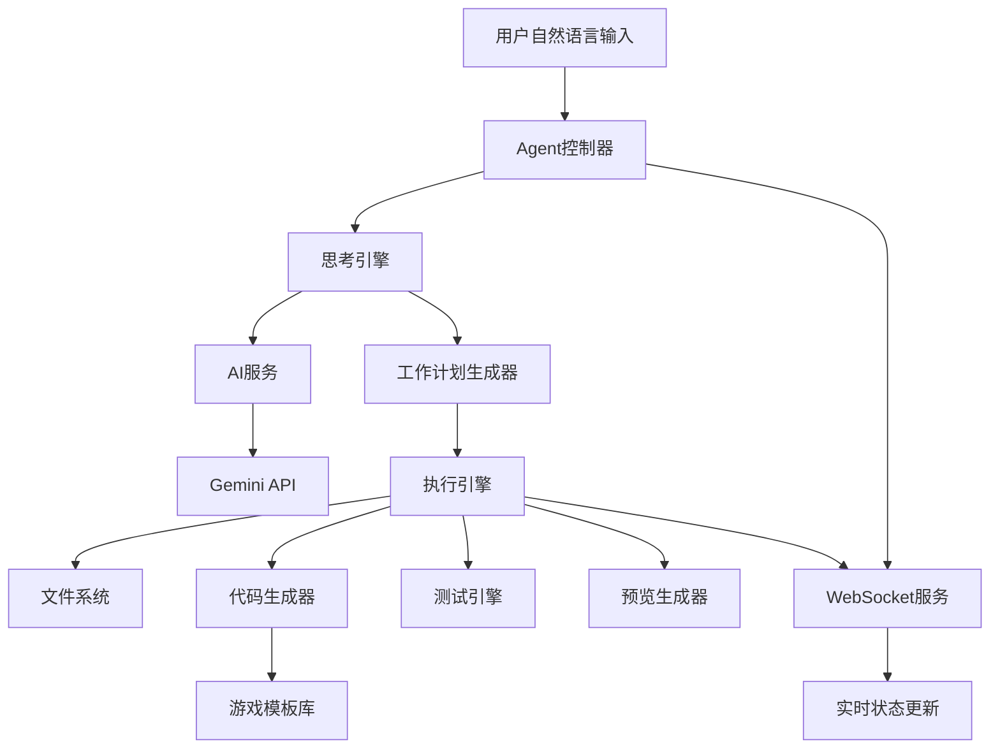
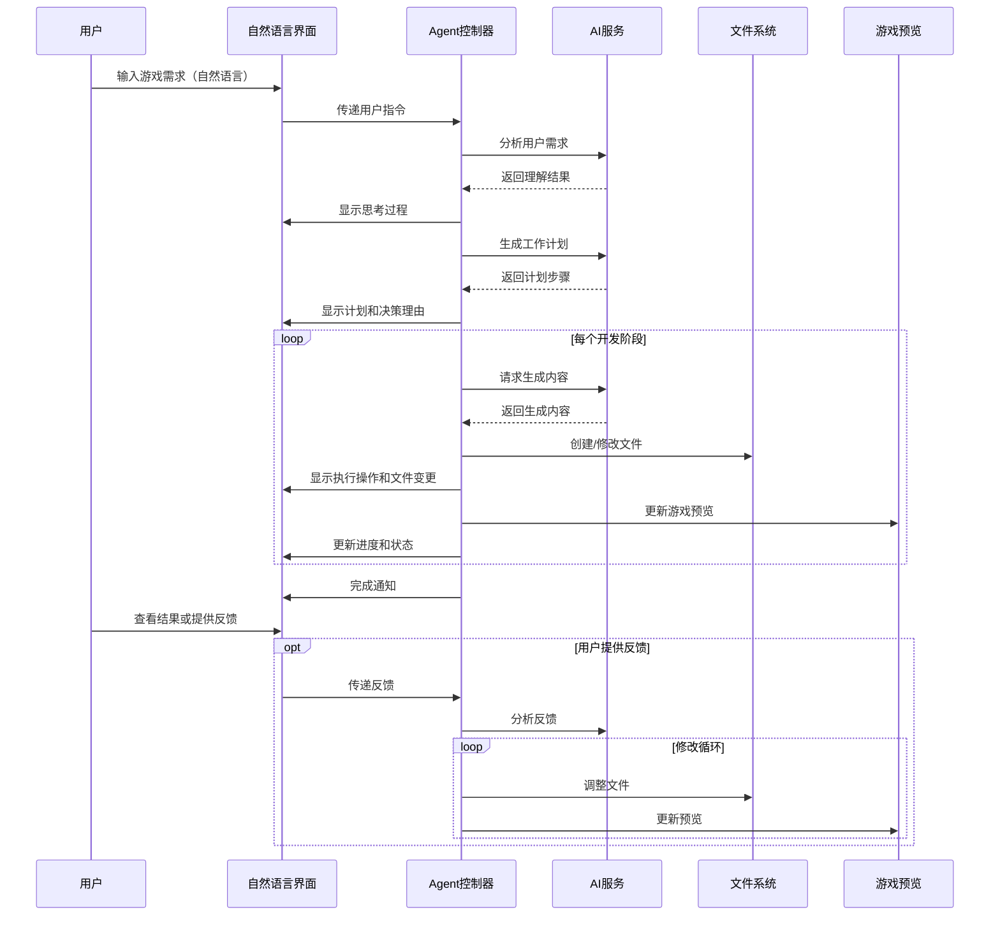
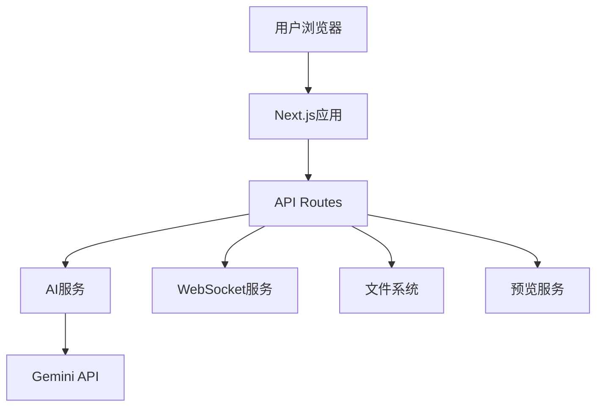

# GameAgent - 教学互动游戏生成工具设计文档

## 1. 系统架构

### 1.1 总体架构

系统采用前后端分离的架构，前端使用Next.js框架，后端通过API与Gemini进行交互。



### 1.2 组件架构

系统由以下主要组件构成：

1. **前端UI组件**：负责用户界面展示和交互
2. **Agent控制器**：协调各组件工作，管理工作流程
3. **AI服务**：与Gemini API交互，处理自然语言理解和生成
4. **执行引擎**：执行代码生成、文件操作等任务
5. **WebSocket服务**：提供实时状态更新和通信
6. **游戏预览服务**：构建和展示生成的游戏

### 1.3 技术栈详情

- **前端**：
  - Next.js 14+
  - React 18+
  - TypeScript 5+
  - TailwindCSS（样式）
  - SWR（数据获取）
  - Socket.io-client（WebSocket客户端）

- **后端**：
  - Next.js API Routes
  - Node.js
  - TypeScript
  - Socket.io（WebSocket服务器）
  - ai.service.ts（Gemini API集成）

- **开发工具**：
  - ESLint（代码质量）
  - Prettier（代码格式化）
  - Jest（测试）
  - Cypress（E2E测试）

## 2. 数据流设计

### 2.1 用户交互流程



### 2.2 数据模型

#### 2.2.1 项目数据模型

```typescript
interface Project {
  id: string;
  name: string;
  description: string;
  gameType: GameType;
  createdAt: Date;
  updatedAt: Date;
  status: ProjectStatus;
  files: File[];
  currentStage: DevelopmentStage;
  progress: number; // 0-100
}

enum GameType {
  QUIZ = 'quiz',
  MATCHING = 'matching',
  SORTING = 'sorting',
  DRAG_DROP = 'drag_drop',
  MEMORY = 'memory',
  PUZZLE = 'puzzle',
  SIMULATION = 'simulation',
  ROLE_PLAY = 'role_play'
}

enum ProjectStatus {
  PLANNING = 'planning',
  IN_PROGRESS = 'in_progress',
  PAUSED = 'paused',
  COMPLETED = 'completed'
}

enum DevelopmentStage {
  REQUIREMENT_ANALYSIS = 'requirement_analysis',
  DESIGN = 'design',
  CODING = 'coding',
  TESTING = 'testing',
  OPTIMIZATION = 'optimization'
}
```

#### 2.2.2 文件数据模型

```typescript
interface File {
  id: string;
  name: string;
  path: string;
  type: FileType;
  content: string;
  createdAt: Date;
  updatedAt: Date;
  projectId: string;
}

enum FileType {
  DOCUMENT = 'document', // .md, .txt
  SOURCE_CODE = 'source_code', // .js, .ts, .jsx, .tsx
  STYLE = 'style', // .css, .scss
  ASSET = 'asset', // images, audio
  CONFIG = 'config', // .json, .yaml
  TEST = 'test' // .test.js, .spec.ts
}
```

#### 2.2.3 Agent状态数据模型

```typescript
interface AgentState {
  id: string;
  projectId: string;
  currentTask: string;
  thinking: string; // 当前思考内容
  action: AgentAction; // 当前执行的操作
  stage: DevelopmentStage;
  progress: number; // 0-100
  status: AgentStatus;
  logs: AgentLog[];
  estimatedTimeRemaining: number; // 秒
}

enum AgentStatus {
  IDLE = 'idle',
  THINKING = 'thinking',
  CODING = 'coding',
  TESTING = 'testing',
  PAUSED = 'paused'
}

interface AgentAction {
  type: ActionType;
  description: string;
  target?: string; // 文件路径或其他目标
  timestamp: Date;
}

enum ActionType {
  CREATE_FILE = 'create_file',
  MODIFY_FILE = 'modify_file',
  DELETE_FILE = 'delete_file',
  RUN_TEST = 'run_test',
  BUILD = 'build',
  ANALYZE = 'analyze'
}

interface AgentLog {
  id: string;
  message: string;
  level: LogLevel;
  timestamp: Date;
  context?: any;
}

enum LogLevel {
  INFO = 'info',
  WARNING = 'warning',
  ERROR = 'error',
  SUCCESS = 'success'
}
```

### 2.3 API设计

#### 2.3.1 RESTful API

| 端点                      | 方法   | 描述          | 请求体                             | 响应                   |
| ------------------------- | ------ | ------------- | ---------------------------------- | ---------------------- |
| `/api/projects`           | GET    | 获取所有项目  | -                                  | `Project[]`            |
| `/api/projects`           | POST   | 创建新项目    | `{ name, description, gameType }`  | `Project`              |
| `/api/projects/:id`       | GET    | 获取特定项目  | -                                  | `Project`              |
| `/api/projects/:id`       | PUT    | 更新项目      | `{ name?, description?, status? }` | `Project`              |
| `/api/projects/:id`       | DELETE | 删除项目      | -                                  | `{ success: boolean }` |
| `/api/projects/:id/files` | GET    | 获取项目文件  | -                                  | `File[]`               |
| `/api/files/:id`          | GET    | 获取文件内容  | -                                  | `File`                 |
| `/api/files/:id`          | PUT    | 更新文件内容  | `{ content }`                      | `File`                 |
| `/api/agent/status`       | GET    | 获取Agent状态 | -                                  | `AgentState`           |
| `/api/agent/control`      | POST   | 控制Agent     | `{ action: 'start'                 | 'pause'                | 'resume' | 'stop' }` | `{ success: boolean }` |

#### 2.3.2 WebSocket事件

| 事件名称          | 方向          | 描述              | 数据                                            |
| ----------------- | ------------- | ----------------- | ----------------------------------------------- |
| `agent:thinking`  | 服务器→客户端 | Agent思考过程更新 | `{ projectId, thinking }`                       |
| `agent:action`    | 服务器→客户端 | Agent执行操作     | `{ projectId, action }`                         |
| `agent:progress`  | 服务器→客户端 | 进度更新          | `{ projectId, stage, progress, timeRemaining }` |
| `agent:log`       | 服务器→客户端 | 日志消息          | `{ projectId, log }`                            |
| `file:created`    | 服务器→客户端 | 文件创建通知      | `{ projectId, file }`                           |
| `file:updated`    | 服务器→客户端 | 文件更新通知      | `{ projectId, fileId, changes }`                |
| `file:deleted`    | 服务器→客户端 | 文件删除通知      | `{ projectId, fileId }`                         |
| `preview:updated` | 服务器→客户端 | 预览更新通知      | `{ projectId, url }`                            |

## 3. 详细组件设计

### 3.1 前端组件

#### 3.1.1 页面组件

- **MainLayout**: 主布局组件，包含所有工作区组件
  - 负责整体布局和响应式调整
  - 管理各面板的大小和位置

- **NaturalLanguageInput**: 自然语言输入组件
  - 多行文本输入框
  - 历史消息展示
  - 快捷指令按钮
  - 发送按钮

- **AgentWorkspacePanel**: Agent工作展示面板
  - 包含思考过程、执行操作和文件变更三个子面板
  - 支持面板切换和调整大小

- **GamePreviewPanel**: 游戏预览面板
  - iframe容器
  - 刷新按钮
  - 调整大小控件

- **ProjectExplorerPanel**: 项目资源面板
  - 文件树组件
  - 文件查看器
  - 折叠/展开控制

- **StatusControlBar**: 状态控制栏
  - 进度条组件
  - 状态指示器
  - 控制按钮
  - 时间估计显示

#### 3.1.2 UI组件层次结构

```
MainLayout
├── Header
│   └── ProjectSelector
├── NaturalLanguageInput
│   ├── InputArea
│   ├── MessageHistory
│   └── QuickCommandButtons
├── MainContent
│   ├── AgentWorkspacePanel
│   │   ├── ThinkingProcessPanel
│   │   ├── ActionExecutionPanel
│   │   └── FileChangesPanel
│   ├── GamePreviewPanel
│   │   ├── IframeContainer
│   │   └── PreviewControls
│   └── ProjectExplorerPanel
│       ├── FileTree
│       └── FileViewer
└── StatusControlBar
    ├── ProgressIndicator
    ├── StageIndicator
    ├── TimeEstimator
    └── ControlButtons
```

### 3.2 Agent组件

#### 3.2.1 Agent控制器

Agent控制器是系统的核心组件，负责协调各个子系统的工作。主要功能包括：

- 接收和解析用户指令
- 管理Agent生命周期和状态
- 协调AI服务调用
- 监督执行引擎工作
- 管理WebSocket通信

```typescript
class AgentController {
  constructor(projectId: string) {
    // 初始化
  }
  
  // 启动Agent工作流程
  async start(instruction: string): Promise<void> {
    // 实现
  }
  
  // 暂停Agent工作
  pause(): void {
    // 实现
  }
  
  // 继续Agent工作
  resume(): void {
    // 实现
  }
  
  // 停止Agent工作
  stop(): void {
    // 实现
  }
  
  // 处理用户反馈
  async handleFeedback(feedback: string): Promise<void> {
    // 实现
  }
  
  // 获取当前状态
  getState(): AgentState {
    // 实现
  }
}
```

#### 3.2.2 思考引擎

思考引擎负责生成和管理Agent的思考过程，使其对用户可见。主要功能包括：

- 生成结构化思考步骤
- 解释决策理由
- 预测潜在问题
- 规划解决方案

```typescript
class ThinkingEngine {
  constructor(aiService: AIService) {
    // 初始化
  }
  
  // 分析用户需求
  async analyzeRequirement(instruction: string): Promise<RequirementAnalysis> {
    // 实现
  }
  
  // 生成工作计划
  async generateWorkPlan(analysis: RequirementAnalysis): Promise<WorkPlan> {
    // 实现
  }
  
  // 解决问题
  async solveProblem(problem: Problem): Promise<Solution> {
    // 实现
  }
  
  // 评估代码
  async evaluateCode(code: string): Promise<CodeEvaluation> {
    // 实现
  }
}
```

#### 3.2.3 执行引擎

执行引擎负责执行具体的操作，如文件创建、代码生成等。主要功能包括：

- 文件系统操作
- 代码生成和修改
- 测试执行
- 构建和预览

```typescript
class ExecutionEngine {
  constructor(fileSystem: FileSystem, codeGenerator: CodeGenerator, testRunner: TestRunner) {
    // 初始化
  }
  
  // 执行工作计划
  async executeWorkPlan(plan: WorkPlan): Promise<void> {
    // 实现
  }
  
  // 创建文件
  async createFile(path: string, content: string): Promise<File> {
    // 实现
  }
  
  // 修改文件
  async modifyFile(fileId: string, changes: FileChanges): Promise<File> {
    // 实现
  }
  
  // 删除文件
  async deleteFile(fileId: string): Promise<boolean> {
    // 实现
  }
  
  // 运行测试
  async runTests(filePatterns: string[]): Promise<TestResult> {
    // 实现
  }
  
  // 构建项目
  async buildProject(): Promise<BuildResult> {
    // 实现
  }
}
```

### 3.3 游戏生成引擎

游戏生成引擎负责基于模板生成各类教学游戏。主要功能包括：

- 模板选择和适配
- 游戏逻辑生成
- UI组件生成
- 资源生成和集成

```typescript
class GameGenerator {
  constructor(templateLibrary: TemplateLibrary) {
    // 初始化
  }
  
  // 选择合适的模板
  selectTemplate(gameType: GameType, requirements: GameRequirements): Template {
    // 实现
  }
  
  // 生成游戏代码
  async generateGameCode(template: Template, customizations: Customizations): Promise<GameCode> {
    // 实现
  }
  
  // 生成游戏资源
  async generateGameAssets(requirements: GameRequirements): Promise<GameAssets> {
    // 实现
  }
  
  // 集成游戏组件
  async integrateGameComponents(code: GameCode, assets: GameAssets): Promise<Game> {
    // 实现
  }
}
```

## 4. 用户界面设计

### 4.1 布局设计

系统界面采用分区布局，确保各功能区域清晰可见且易于交互。

```
+-------------------------------------------+
|                 顶部导航栏                 |
+-------------------------------------------+
|          自然语言交互区                    |
+----------+-------------------+------------+
|          |                   |            |
|  项目    |   Agent工作展示区  |   游戏     |
|  资源    |   (思考/执行/变更) |   预览     |
|  区      |                   |   区       |
|          |                   |            |
|          |                   |            |
+----------+-------------------+------------+
|        状态栏 & 控制按钮                   |
+-------------------------------------------+
```

### 4.2 界面元素设计

#### 4.2.1 自然语言交互区

- **输入框**：
  - 高度自适应的多行文本框
  - 占据顶部区域的大部分宽度
  - 支持Markdown格式输入
  - 自动补全和提示功能

- **历史消息**：
  - 可滚动的消息历史记录
  - 用户消息和Agent响应区分显示
  - 支持消息折叠/展开
  - 代码块语法高亮

- **快捷指令按钮**：
  - 常用指令的快捷按钮
  - 悬停显示详细说明
  - 可自定义和扩展

#### 4.2.2 Agent工作展示区

- **思考过程面板**：
  - 结构化展示思考步骤
  - 使用缩进和图标表示层次
  - 关键决策高亮显示
  - 支持展开/折叠详细内容

- **执行操作面板**：
  - 命令行风格界面
  - 操作类型图标标记
  - 时间戳显示
  - 状态指示（成功/失败/进行中）

- **文件变更面板**：
  - 差异对比视图
  - 文件树结构导航
  - 变更类型颜色编码
  - 代码语法高亮

#### 4.2.3 游戏预览区

- **iframe容器**：
  - 自适应大小
  - 边框和阴影效果
  - 加载状态指示器

- **预览控制**：
  - 刷新按钮
  - 全屏切换
  - 设备模拟选择（响应式测试）

#### 4.2.4 项目资源区

- **文件树**：
  - 层次结构展示
  - 文件类型图标
  - 上下文菜单
  - 搜索过滤功能

- **文件查看器**：
  - 代码语法高亮
  - 行号显示
  - 只读模式指示
  - 切换到编辑模式按钮（非默认）

#### 4.2.5 状态控制栏

- **进度条**：
  - 多阶段进度显示
  - 当前阶段高亮
  - 悬停显示详细信息

- **状态指示器**：
  - 图标和文字组合
  - 颜色编码（思考中、编码中、测试中等）

- **控制按钮**：
  - 暂停/继续按钮
  - 重启按钮
  - 编辑模式切换按钮

- **时间估计**：
  - 预计完成时间显示
  - 倒计时格式

### 4.3 交互设计

#### 4.3.1 自然语言交互

- **输入提交**：
  - 按Enter键（无Shift）提交
  - 点击发送按钮提交
  - 提交后自动清空输入框

- **历史浏览**：
  - 上下箭头键浏览历史输入
  - 点击历史消息可复制到输入框

- **快捷指令**：
  - 点击快捷指令按钮自动填充输入框
  - 支持自定义快捷指令

#### 4.3.2 面板交互

- **面板调整**：
  - 拖动分隔线调整面板大小
  - 双击分隔线重置为默认大小
  - 点击面板标题栏最小化/最大化面板

- **标签页切换**：
  - 在Agent工作展示区中切换不同面板
  - 支持键盘快捷键切换

- **滚动行为**：
  - 自动滚动跟随最新内容
  - 手动滚动时暂停自动滚动
  - 返回底部按钮快速回到最新内容

#### 4.3.3 文件交互

- **文件浏览**：
  - 点击文件夹展开/折叠
  - 点击文件在查看器中打开
  - 右键菜单提供额外操作

- **文件查看**：
  - 语法高亮显示
  - 代码折叠
  - 搜索功能
  - 切换到编辑模式（需确认）

#### 4.3.4 控制交互

- **工作流控制**：
  - 暂停/继续按钮控制Agent工作
  - 重启按钮重新开始当前任务
  - 编辑模式切换需确认

- **预览控制**：
  - 刷新按钮手动更新预览
  - 调整大小控件改变预览区域大小
  - 设备模拟下拉菜单选择不同设备尺寸

## 5. 技术实现细节

### 5.1 Agent思考过程可视化

Agent的思考过程将通过以下方式显性化：

#### 5.1.1 思考阶段标记

Agent的思考过程将被分解为以下标准化阶段：

1. **问题定义**：
   - 明确当前需要解决的问题
   - 提取用户指令中的关键需求
   - 确定约束条件和优先级

2. **信息收集**：
   - 列出已知信息
   - 识别需要获取的信息
   - 确定信息来源

3. **方案构思**：
   - 提出可能的解决方案
   - 列举各方案的实现步骤
   - 考虑技术可行性

4. **方案评估**：
   - 分析各方案的优缺点
   - 考虑时间和资源约束
   - 评估潜在风险

5. **决策**：
   - 选择最佳方案
   - 解释选择理由
   - 制定实施计划

每个阶段将使用特定的图标、颜色和格式在界面中展示，使用户能够清晰地跟踪Agent的思考过程。

#### 5.1.2 代码生成过程展示

代码生成过程将通过以下步骤展示：

1. **结构规划**：
   - 展示文件和目录结构
   - 定义组件和模块关系
   - 规划数据流

2. **函数/组件设计**：
   - 定义函数签名和组件接口
   - 说明参数和返回值
   - 描述组件职责和生命周期

3. **算法选择**：
   - 解释算法选择理由
   - 分析时间和空间复杂度
   - 考虑替代算法

4. **代码实现**：
   - 展示代码生成的中间步骤
   - 解释关键代码段
   - 添加注释说明

5. **优化和重构**：
   - 识别优化机会
   - 解释重构决策
   - 展示优化前后对比

### 5.2 WebSocket实时更新

WebSocket将用于以下实时更新：

#### 5.2.1 连接管理

```typescript
// 客户端连接管理
class WebSocketManager {
  private socket: Socket;
  
  constructor(projectId: string) {
    this.socket = io('/agent', {
      query: { projectId }
    });
    this.setupEventListeners();
  }
  
  private setupEventListeners() {
    this.socket.on('agent:thinking', this.handleThinkingUpdate);
    this.socket.on('agent:action', this.handleActionUpdate);
    this.socket.on('agent:progress', this.handleProgressUpdate);
    this.socket.on('agent:log', this.handleLogUpdate);
    this.socket.on('file:created', this.handleFileCreated);
    this.socket.on('file:updated', this.handleFileUpdated);
    this.socket.on('file:deleted', this.handleFileDeleted);
    this.socket.on('preview:updated', this.handlePreviewUpdated);
  }
  
  // 事件处理方法...
}
```

#### 5.2.2 事件类型

1. **Agent状态更新**：
   - `agent:thinking`: Agent思考过程更新
   - `agent:action`: Agent执行操作
   - `agent:progress`: 进度更新
   - `agent:log`: 日志消息

2. **文件变更通知**：
   - `file:created`: 文件创建事件
   - `file:updated`: 文件修改事件
   - `file:deleted`: 文件删除事件

3. **预览更新**：
   - `preview:updated`: 游戏预览更新

#### 5.2.3 实现方式

服务器端使用Socket.io实现WebSocket服务，客户端使用Socket.io-client连接。每个项目创建一个独立的房间，确保消息只发送给相关客户端。

```typescript
// 服务器端WebSocket实现
import { Server } from 'socket.io';

export function setupWebSocketServer(server) {
  const io = new Server(server);
  
  // Agent命名空间
  const agentNamespace = io.of('/agent');
  
  agentNamespace.on('connection', (socket) => {
    const { projectId } = socket.handshake.query;
    
    if (projectId) {
      socket.join(`project:${projectId}`);
      console.log(`Client connected to project ${projectId}`);
    }
    
    socket.on('disconnect', () => {
      console.log('Client disconnected');
    });
  });
  
  return {
    emitThinkingUpdate: (projectId, data) => {
      agentNamespace.to(`project:${projectId}`).emit('agent:thinking', data);
    },
    emitActionUpdate: (projectId, data) => {
      agentNamespace.to(`project:${projectId}`).emit('agent:action', data);
    },
    // 其他emit方法...
  };
}
```

### 5.3 游戏预览实现

游戏预览将通过以下方式实现：

#### 5.3.1 动态构建

1. **文件监听**：
   - 监听项目文件变更
   - 触发自动构建流程
   - 通知预览组件刷新

2. **构建流程**：
   - 使用Next.js构建API
   - 生成静态HTML、CSS和JavaScript
   - 处理资源文件

3. **预览服务**：
   - 提供静态文件服务
   - 支持热重载
   - 处理API请求模拟

#### 5.3.2 iframe集成

```typescript
// 预览组件实现
const GamePreview: React.FC<{ projectId: string }> = ({ projectId }) => {
  const [previewUrl, setPreviewUrl] = useState('');
  const [isLoading, setIsLoading] = useState(true);
  const iframeRef = useRef<HTMLIFrameElement>(null);
  
  useEffect(() => {
    // 设置WebSocket监听预览更新
    socket.on('preview:updated', (data) => {
      if (data.projectId === projectId) {
        setPreviewUrl(data.url);
        setIsLoading(true);
      }
    });
    
    // 初始加载预览URL
    fetchPreviewUrl(projectId).then(url => {
      setPreviewUrl(url);
    });
    
    return () => {
      socket.off('preview:updated');
    };
  }, [projectId]);
  
  const handleIframeLoad = () => {
    setIsLoading(false);
  };
  
  const handleRefresh = () => {
    if (iframeRef.current) {
      iframeRef.current.src = previewUrl + '?t=' + new Date().getTime();
    }
  };
  
  return (
    <div className="game-preview-panel">
      {isLoading && <div className="loading-indicator">加载中...</div>}
      <div className="preview-controls">
        <button onClick={handleRefresh}>刷新</button>
        <select onChange={(e) => setDeviceSize(e.target.value)}>
          <option value="desktop">桌面</option>
          <option value="tablet">平板</option>
          <option value="mobile">手机</option>
        </select>
      </div>
      <iframe
        ref={iframeRef}
        src={previewUrl}
        onLoad={handleIframeLoad}
        className={`preview-iframe ${isLoading ? 'loading' : ''}`}
        title="游戏预览"
      />
    </div>
  );
};
```

## 6. 部署与扩展

### 6.1 部署架构

系统将采用以下部署架构：



### 6.2 扩展性设计

系统设计考虑了以下扩展点：

1. **游戏模板系统**：
   - 支持添加新的游戏类型模板
   - 模板可通过插件机制扩展
   - 自定义模板存储和管理

2. **AI服务扩展**：
   - 支持切换不同的AI提供商
   - 可扩展的提示工程系统
   - 自定义思考过程结构

3. **UI主题和定制**：
   - 可切换的UI主题
   - 自定义面板布局
   - 可配置的快捷指令

4. **插件系统**：
   - 支持第三方插件
   - 标准化的插件API
   - 插件管理界面

### 6.3 性能优化

系统将采用以下性能优化策略：

1. **代码分割**：
   - 按路由分割代码
   - 组件懒加载
   - 动态导入

2. **缓存策略**：
   - API响应缓存
   - 模板缓存
   - 生成代码缓存

3. **资源优化**：
   - 图像优化
   - CSS和JS压缩
   - 字体优化

4. **服务器优化**：
   - 服务器端渲染
   - 静态生成
   - API路由优化

## 7. 安全考虑

### 7.1 API安全

1. **密钥管理**：
   - 使用环境变量存储API密钥
   - 密钥轮换机制
   - 访问控制和审计

2. **请求验证**：
   - 输入验证
   - CSRF保护
   - 速率限制

### 7.2 数据安全

1. **数据存储**：
   - 敏感数据加密
   - 安全的文件存储
   - 数据备份策略

2. **用户数据**：
   - 最小化收集
   - 明确的数据使用政策
   - 数据删除机制

### 7.3 代码安全

1. **生成代码安全**：
   - 代码注入防护
   - 安全的代码执行环境
   - 代码审计机制

2. **依赖管理**：
   - 定期更新依赖
   - 漏洞扫描
   - 最小化依赖

## 8. 测试策略

### 8.1 单元测试

- 组件测试
- 服务测试
- 工具函数测试

### 8.2 集成测试

- API集成测试
- WebSocket测试
- 文件系统测试

### 8.3 端到端测试

- 用户流程测试
- 游戏生成测试
- 性能测试

### 8.4 用户体验测试

- 可用性测试
- A/B测试
- 用户反馈收集
